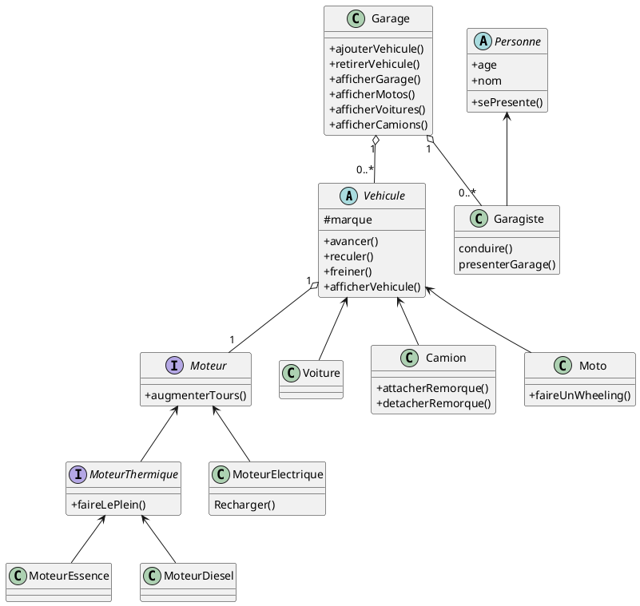

# Exercice Garage

## Diagramme de classe

```plantuml
@startuml

skinparam classAttributeIconSize 0

abstract class Vehicule {
  #marque
  +avancer()
  +reculer()
  +freiner()
  +afficherVehicule()
}

Vehicule "1" o-- "1" Moteur

class Voiture {}
Vehicule <-- Voiture

class Camion {
  +attacherRemorque()
  +detacherRemorque()
}
Vehicule <-- Camion

class Moto {
  +faireUnWheeling()
}
Vehicule <-- Moto

interface Moteur {
  +augmenterTours()
}

Moteur <-- MoteurThermique

interface MoteurThermique {
  +faireLePlein()
}
class MoteurEssence {}
MoteurThermique <-- MoteurEssence
class MoteurDiesel {}
MoteurThermique <-- MoteurDiesel

class MoteurElectrique {
  Recharger()
}
Moteur <-- MoteurElectrique

class Garage {
  +ajouterVehicule()
  +retirerVehicule()
  +afficherGarage()
  +afficherMotos()
  +afficherVoitures()
  +afficherCamions()
}
Garage "1" o-- "0..*" Vehicule
Garage "1" o-- "0..*" Garagiste

abstract class Personne {
  +age
  +nom
  +sePresente()
}

class Garagiste {
  conduire()
  presenterGarage()
}
Personne <-- Garagiste


@enduml
```
